# **Hello, I am [Maximiliano Marolda](https://www.linkedin.com/in/maximarolda/)** 

## About Me 
Github

🔭 I'm a mechanical engineer venturing into the exciting world of programming as FullStack Developer. I’m currently working on my Portfolio and finishing up some other projects. I am using plain html and css to create it. My main collaborative project is deployed in Vercel, the others for now will be linked to my github profile.

🌱 I’m currently learning Angular and Typescript.

👯 I like great challenges and I undertake them with passion, commitment and determination. I am interested in web 🖥️ and moblie 📱 development, mainly back-end.

💬 Talk to me about JavaScript, React.js, Node.js, Sequelize, Express, HTML, CSS, Bootstrap, Redux, and obviously a little about TypeScript and Angular.

## Skills 

## 📌 My Proyects
### B2B commodities proyect:
It was designed and developed as a  business to business service for importers & exporters of International Commodities with a login, bookmarks, user profile, administrator profile and a payment gateaway with Paypal..
It is ment to be a grupal simulation of real codding experience with regular SCRUM meetins and a common repository where we all pushed our code, as part of Henry's bootcamp.
In this proyect I worked as a BackEnd developer and DataBase leader, and we use the following tecnologies: 
Javascript | React Native | CSS | Redux | Node | Sequelize | PostgreSQL | Git Hub | Figma | Trello | GenMyModel

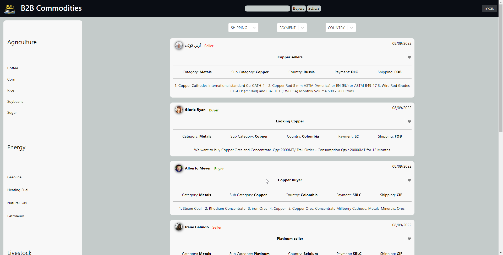

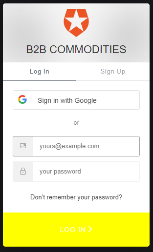

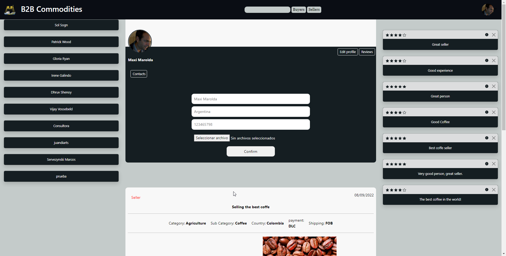

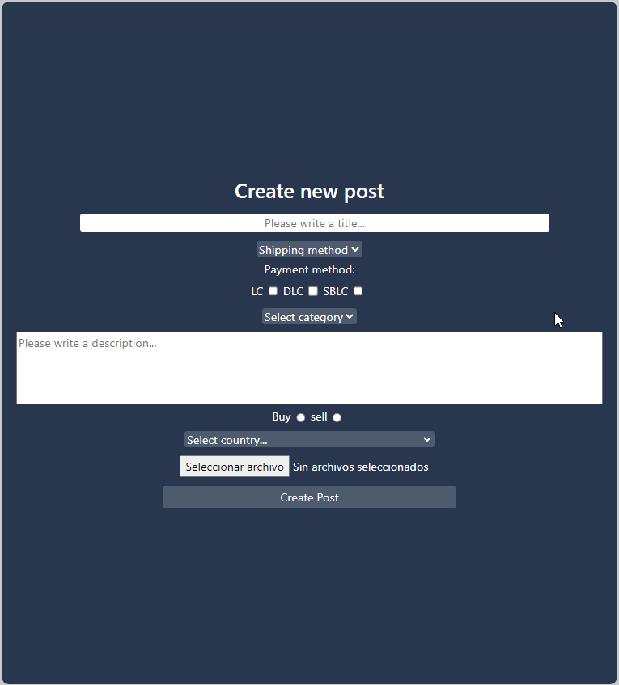

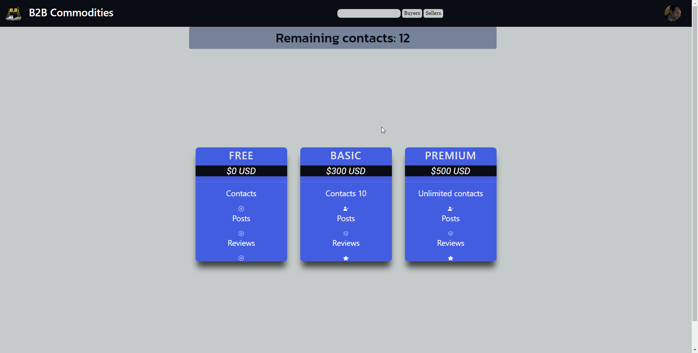

### Henry Pokemons
Single-page application focused on the amazing Pokemon world. 
I developed the whole Aplication, Front and Back End with the following technologies: 
Javascript | HTML | CSS | React | Redux | Node | Sequelize | PostgreSQL 

<a href="https://github.com/MaxiMarolda/Proyecto-Pokemons">
      
      Link to repo
</a>
 

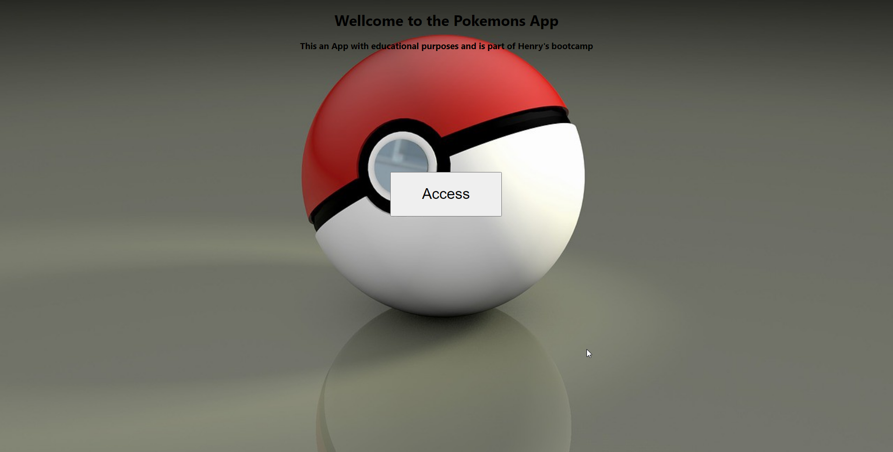

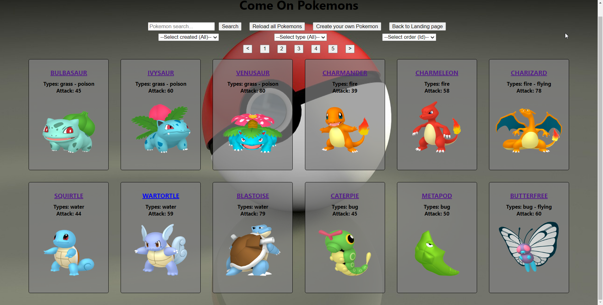
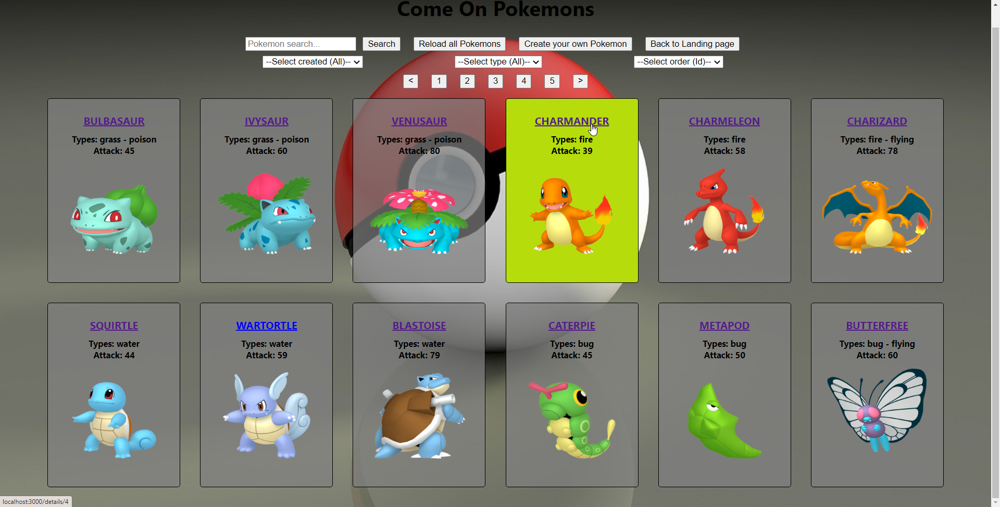

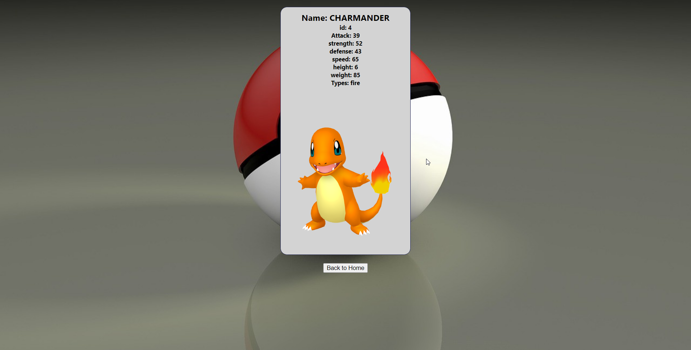
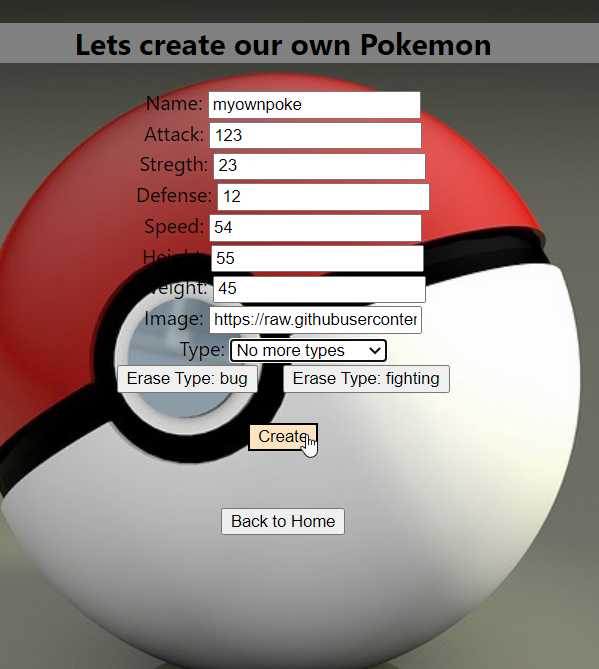
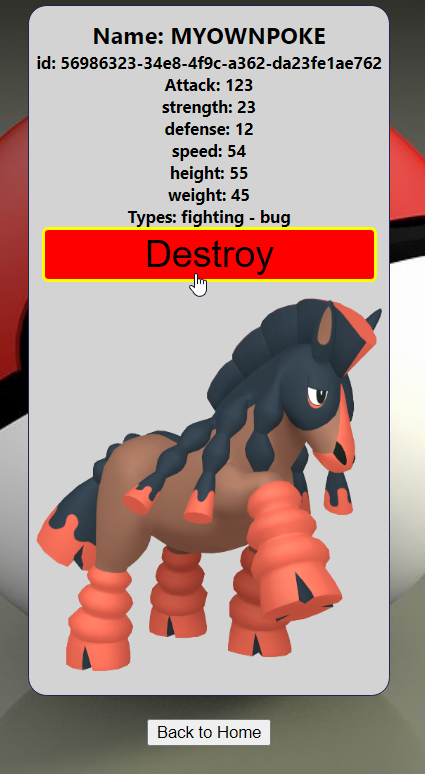

 
 

### 📫 Contact Me 

    <a href="https://mmarolda12@gmail.com">
      
      mmarolda12@gmail.com
    </a>    
     
    <a href="https://www.linkedin.com/in/maximarolda/">
      
      Maximiliano Marolda
    </a>

 

